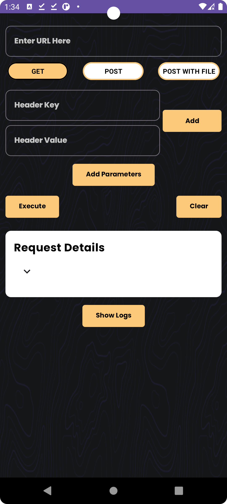
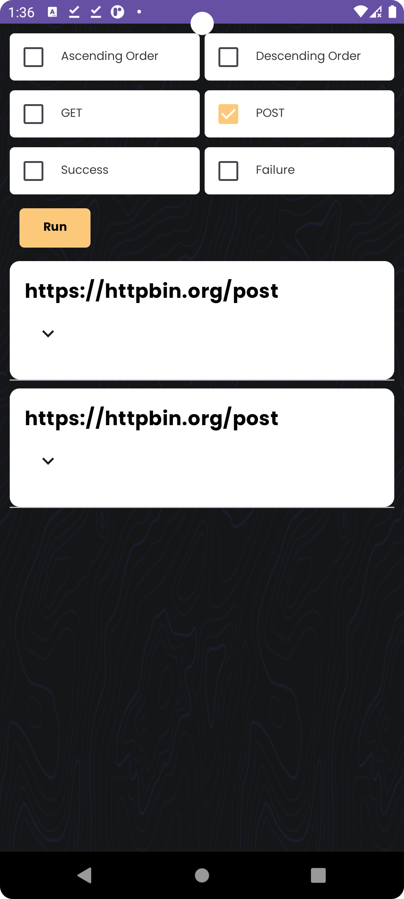

<h1 align="center"> Building Api Requests App without any third-party library </h1>


# Overview

- Building Api Requests App without Retrofit and any third-party library.
- It was a really interesting task i loved creating the app and the challenges I faced
- Implemented Methods: GET , POST, POST with File Upload 

# Tech Stacks

- MVVM Architecture: The Arch promotes reusability of code, greatly simplifying the process of creating simple user interfaces
- Jetpack Compose: Using Modern Tech of Jetpack Compose.
- httpUrlConnection: Used for Handling all requests.
- Sqlite: Used to cache responses and requests.


# Api Service 

As I got started, my main concern was figuring out how to make requests without Retrofit. So with simple search showed me that I could use HttpUrlConnection instead.
So Now let's start to figure out how the HTTPURLConnection works: 

1. Create an Url Object from our Input Url : 
```kotlin
    val url = URL(inputUrl.toString())
```
2. Open Connection: Using the openConnection() method of the URL object, 
```kotlin
    httpURLConnection = url.openConnection() as HttpURLConnection
```
3. Set Request Method & Request Headers (Optional): Default Request Type is GET

5. Now we come with the part of sending and receiving data, if we want to send data we get the output stream from the connection and if we want to receive data we get the input stream from the connection.

6. Now the request is done then we map results to our API response model

7. Finally we close the connection
```kotlin
    httpurlconnection.disconnect()
```
*If you Wondered like me at first where actually the connection starts I got you, after a quick search I found that httpurlconnection starts the connection when we try to get the stream for receiving or sending data*

As Simple as that I finished Creating 3 methods for requests one for GET Requests, POST with JSON Body and one for File UPLOAD

# Caching and Database 
As mentioned in the task description we are not allowed to use room so what came to my mind first creating caching with SQLite Database I created 3 classes 

1. Table Object containing all data about database like :(Db name, Columns names, Table Creation and Dropping Query)
   
2. Model data class for our database objects and mapping functions to our domain object.
   
3. Database Helper Class for executing all Queries and filtering data from the database. 

# Domain 
Since We are Done Now with our data layer it turns to create a domain layer which is simple now:

1. I Created a data class for responses for the domain model which we will use in our app layer
2. Repository Interface containing all necessary functions

# Viewmodel 
I created view models based on events and states each View model contains a state so as simple as that if any event occurs in the UI like user interaction or whatever we update the state with changes
so for each view model, there is one state and one function called onEvent() Responding to All Possible Events coming from the UI


*I have two challenges, in that case, how am gonna run repo functions in the background thread (As we are doing tasks that could take a long time to execute so it can block our UI Thread ) if I can do so, how I am gonna interact from the thread to update our Ui with new state (As we know we cannot interact with UI directly from the background thread)*


The easy solution we can do is to call 
```kotlin
thread(start = true) {
 // your block of code here 
}
```
But that way is not optimal as each time we run a background task we will create a new Thread which is not effective as creating a thread is an overhead and can slow the execution of the app so we need another solution.

So There are several ways of doing tasks in the background thread without coroutine and without creating a new thread each time (Async task, Work Manager and Executor ), We cannot use the async task as it's deprecated So I decided to run a block in the background thread with *Executors* in Java with CachedThreadPool (Creates a thread pool that creates new threads as needed, but will reuse previously constructed threads when they are available.)

1. So I created  an instance of executor and function to submit any block of code in it.
```kotlin
private val executors = Executors.newCachedThreadPool()

fun runInBackground(block: () -> Unit) {
  executors.submit(block)
}
```
2. As we know each thread has exactly one looper so when We create a handler with Looper.getMainLooper() that means we associate that handler to post any blocks or messages in the Messaging Queue of the UI thread.
3. For the UI thread I created uiHanlder this allows us to post and process messages on the main thread's message queue, which is essential for updating the UI from background threads.

```kotlin
private val uiHandler = Handler(Looper.getMainLooper())

fun runInUiThread(block: () -> Unit) {
  uiHandler.post(block)
}
```

*Note: In my case, I am using state and events so even if we didn't use runInUiThread the code will still work. Why? Cause the background thread in that case doesn't interact with the UI directly it updates the state and the state updates UI.*


# UI Screens 

I built the UI with Jetpack compose I built only 2 screens one for executing requests and one for listing all of the logs.

For each screen, I created one data class as screen state and one sealed class for holding all possible events in the app.


|                   Main Screen                        |                   Logs Screen                      |                     
|:----------------------------------------------------:|:--------------------------------------------------:|
|                        |                             | 


